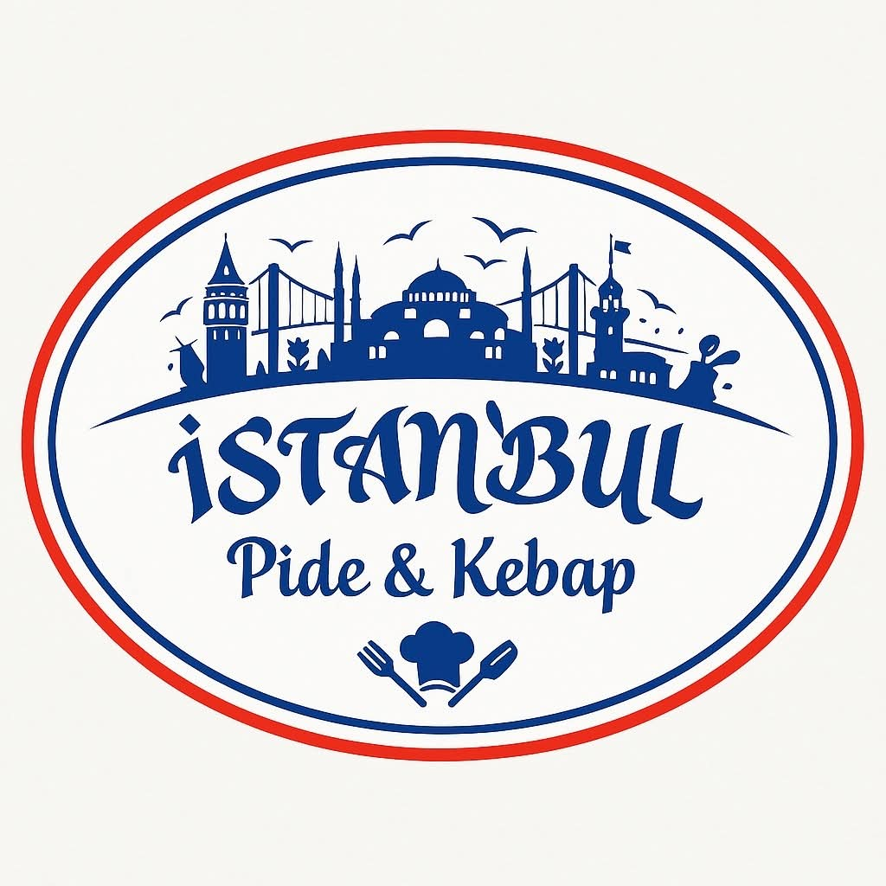

<p align="center">
  
</p>

<h1 align="center">Istanbul Fast Food</h1>

<p align="center">
  <b>Commander un repas à Kinshasa, le suivre jusqu'à sa porte, et le recevoir chaud.</b>
</p>

Istanbul Fast Food est une plateforme complète de commande et de livraison,
pensée pour un restaurant qui veut vendre en ligne sans dépendre d'un
intermédiaire : pas de commission prélevée sur chaque plat, pas de client
« emprunté » par une place de marché. Le restaurant garde sa carte, ses prix,
ses clients et ses livreurs.

---

## Ce que la plateforme comprend

Quatre surfaces, un seul système derrière.

### 🛍️ La vitrine en ligne

Un site public où l'on découvre le menu, choisit ses plats, indique son adresse
et paie sa commande, depuis un ordinateur ou un téléphone, **sans rien
installer**. C'est la porte d'entrée : on peut parcourir la carte librement, et
la création de compte n'arrive qu'au moment de valider.

### 📱 L'application client

Pour les habitués. On y retrouve son historique, ses adresses enregistrées, ses
plats favoris, un bouton « commander à nouveau », et le suivi en direct du
livreur sur une carte. Les notifications préviennent à chaque étape : commande
acceptée, en préparation, en route, livreur arrivé.

### 🛵 L'application livreur

L'outil de travail du coursier. Il voit les courses disponibles, accepte celle
qui lui convient, suit l'itinéraire proposé, signale chaque étape et clôt la
livraison en saisissant le code à 4 chiffres donné par le client. Il consulte
aussi son historique et ses revenus.

### 🖥️ Le back-office du restaurant

Le poste de pilotage. Les commandes arrivent en direct, à la seconde. Le gérant
les accepte, les fait passer en préparation, puis les confie à un livreur. Il y
gère également :

- **la carte** — plats, catégories, options (taille, sauces, suppléments), photos, ruptures de stock ;
- **les prix et les promotions** — codes promo, réductions, tarifs de livraison par zone ;
- **les zones de livraison** — jusqu'où on livre, et à quel prix ;
- **l'équipe** — livreurs, employés, avec des droits différents selon la fonction ;
- **les chiffres** — ventes du jour, de la semaine, du mois, plats les plus vendus.

---

## Le parcours, de la commande à la porte

```
CLIENT                RESTAURANT              LIVREUR
──────                ──────────              ───────
Panier
Commande passée ───►  Nouvelle commande
                      Acceptée      ───────►
                      En préparation
                      Prête
                      Confiée       ───────►  Course proposée
                                              Acceptée
                                              En route vers le resto
                      Récupérée     ◄───────  Commande récupérée
Suivi en direct                               En route vers le client
                                              Arrivé
Code : 4831 ─────────────────────────────►    Vérification du code
                      Livrée        ◄───────  Livrée
```

Chaque étape est enregistrée, visible par tout le monde en temps réel, et
annoncée par une notification aux personnes concernées. Le **code à 4 chiffres**
ferme la boucle : une commande n'est déclarée livrée que si le client a remis
son code au livreur.

---

## Les choix qui font la différence

**Tout est en direct.** Une commande passée sur un téléphone apparaît sur
l'écran du restaurant en moins d'une seconde. Personne n'a besoin de rafraîchir
quoi que ce soit.

**Ça marche aussi quand le réseau flanche.** À Kinshasa, la connexion n'est pas
toujours au rendez-vous. Les applications continuent de fonctionner hors ligne,
affichent ce qu'elles ont en mémoire, et envoient ce qui était en attente dès
que le réseau revient.

**Les cartes ne coûtent rien.** Le suivi de livraison, l'itinéraire et l'adresse
fonctionnent avec des cartes libres, sans abonnement ni facture. Un rendu plus
fin, façon GPS de voiture, peut être activé en option si l'on y tient.

**Chacun voit ce qui le concerne.** Un client voit ses commandes, un livreur ses
courses, un employé la file du jour sans accès aux chiffres d'affaires. Ces
règles ne sont pas de simples écrans masqués : elles sont appliquées au niveau
de la base de données, ce qui les rend impossibles à contourner.

**Trois niveaux dans l'équipe.** Le *propriétaire* a tout ; le *gérant* tient la
carte, les prix, les promotions et les livreurs ; l'*employé* voit les commandes
du jour et signale les ruptures — ni les prix, ni l'équipe.

**Fidélité intégrée.** Un point par dollar livré, convertible en réduction au
moment de payer. Rien à installer en plus.

---

## Où en est le projet

| | |
|---|---|
| ✅ | Vitrine en ligne, commande et paiement à la livraison |
| ✅ | Applications client et livreur |
| ✅ | Back-office complet : carte, prix, promotions, zones, équipe, statistiques |
| ✅ | Suivi en direct, notifications, mode hors ligne |
| ✅ | Programme de fidélité, notation du livreur, attribution automatique des courses |
| 🚧 | Paiements mobile money (M-Pesa, Orange Money, Airtel Money) |

Le détail des étapes se trouve dans la [feuille de route](docs/ROADMAP.md).

---

## Documentation

- [Installation et déploiement](docs/INSTALLATION.md) — pour les développeurs
- [Architecture technique](docs/ARCHITECTURE.md)
- [Design system](docs/DESIGN-SYSTEM.md)
- [Feuille de route](docs/ROADMAP.md)

---

## Auteur

**Martin BITHA MOPONDA**
Développeur Full Stack
AFRICAN TRANSPORT SYSTEMS Sarl | Kinshasa / RDC

📧 [m.bitha@ats-handling-rdc.com](mailto:m.bitha@ats-handling-rdc.com)
🌐 [www.ats-handling-rdc.com](https://www.ats-handling-rdc.com)
📱 WhatsApp : (+243) 827 241 919 | 853 829 264
